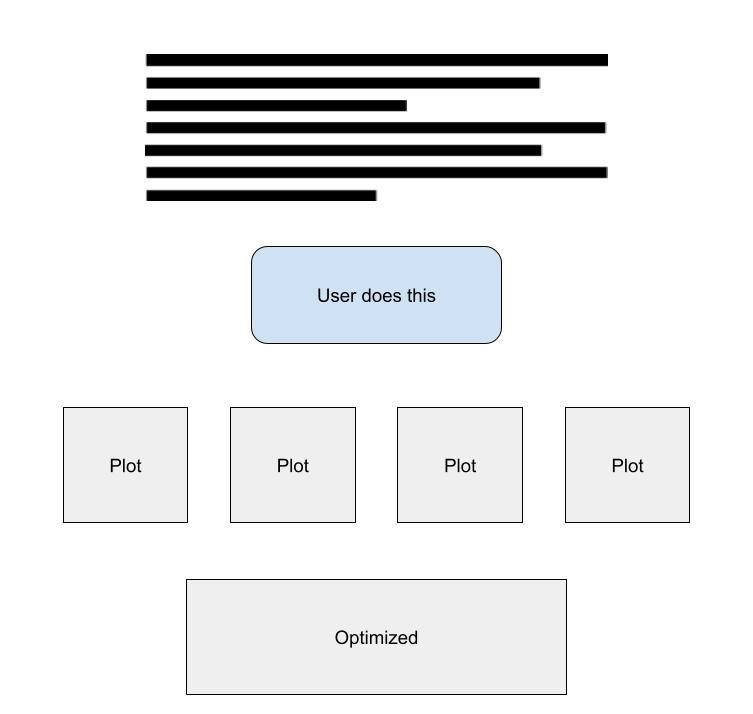

# Final Project Proposal

* **GitHub Repo URL**: https://github.com/CMU-IDS-2021/fp--05839-jblane-rlahiri-cvajiac-amichell
* **Online URL**:  https://share.streamlit.io/cmu-ids-2021/fp--05839-jblane-rlahiri-cvajiac-amichell/main/main_streamlitapp.py

## Introduction

As we generate more and more data over the last decade, frameworks to aid in parallel processing, such as MapReduce, Hadoop, and Spark, have risen in popularity. While these frameworks have made significant strides towards efficient parallel processing of large amounts of data, they are also quite complex, and the details of these systems cannot always be abstracted away from the end user. Often times, a programmer or developer using these systems needs to understand where data is being transferred, which machines are running which jobs, and identify bottlenecks. Therefore, it is essential that these parallel programming frameworks have good interfaces, so that this information can be efficiently presented to the end user.

However, interfaces for these programs are not the top priority, particularly for developers that are more systems oriented. Below, we show an example of the current interface for Spark.

This UI displays some useful information, such as the job duration, stages, and a progress bar. However, all the information is displayed in tabular format and we don’t see a lot of useful information, such as memory usage or shuffle read/writes. While this information is available, it is not presented with effective visual encodings that identify clearly the implication of different characteristics of Spark jobs.  Furthermore, once the end user has hundreds or thousands of jobs, these tables become impossible to parse.

Since creating a new UI for such complex, dynamic systems that updates in-real-time is an incredibly lofty goal, we scope this project by (a) focusing on Spark in particular, and (b) working to create an educational interface that, given a particular job, shows the effect of different optimizations on throughput, memory usage, and other metrics. For each Spark job, we want to show the time it spends executing, shuffling, and reading / writing data. We plan to design our visualization while keeping the eventual goal of a new Spark UI in mind, such that elements from our interface could be directly used in such an interface.

## Proposed Solution

We are seeking to answer the question of what visual encodings can provide a more clear and intuitive visualization of key performance metrics in a Spark job?  We answer this question through the lens of performance optimizations within the Spark framework.  By visualizing the effect of these optimizations on the following performance metrics we will be able to more effectively communicate the effect of different actions within Spark.  Our solution emphasizes the effects of memory behavior within the Spark framework by displaying metrics such as data spill to memory and disk, shuffle read and write quantities, and data input and output.  We also consider execution time and executor idle time as measures of program efficiency.  Important in our visualization is the iterative nature of distributed computing we assume.  In this iterative approach, we presume that developers will begin with a naive approach and will, in time, apply different optimizations to attempt to improve the performance of their Spark jobs.  We have to be careful to use common language where possible, and clearly define any distributed computing / Spark specific terms. Furthermore, we need to carefully consider which images, colors, and graphics we need to display information about the job’s status, and position them accordingly. A potential sketch for our interface is shown below.

## Challenges and Requirements

Our initial challenge will be data generation, collection, and cleaning. We decided against having a hosted web interface where someone can input their own Spark job and see live results due to the adversarial nature of the internet and expensive reality of maintaining a sufficient cluster to process Spark jobs. Thus, we need to create a static dataset of Spark job data. We plan to generate data using at least one of the following three ideas.

### Idea 1: Word Count

This example is often used as an introduction to distributed computing frameworks. The idea is simple and obviously parallel -- count the number of words in a document or set of documents. While this idea is easy to implement and understand as a beginner, we might find that the job is too trivial and that the optimizations might not be sufficiently interesting to visualize.

### Idea 2: Spark for ML

If we find that Idea 1 gives us uninteresting data, we can run a Spark for ML job baseline under many different optimizations. ML training also clearly benefits from parallelism, and this problem might give us some very interesting optimization results. However, these jobs can be complex and expensive, and furthermore, we’d have to be careful with framing the results -- we don’t want to imply that the optimizations that work well for our baseline will work well for all ML models.

### Idea 3: A Large Dataset Extract, Transform, Load Job

Somewhat in between the simplistic and highly complex Spark jobs described above, we also consider applying optimizations to an Extract, Transform, Load (ETL) job on a very large dataset.  This application would read in some very large dataset from the web, perform some transformations to prepare it for efficient queries, and store the data in some intermediate output format to prepare it for loading into a database.

To gather this data, we will use a set of Amazon Web Services EC2 instances on which we will configure a Spark cluster we can submit jobs to.  We will instrument our Spark job using Spark’s RESTful API that allows users to query the Spark driver instance to receive data regarding the job’s performance in the metrics we have previously described.  Spark is created to produce the metrics we would be visualizing already and we can therefore reduce the complexity of the data collection process by using this ready made interface.

## Conclusion

While we scope our project to offline analysis of jobs run through the Spark framework, we hope this project will affect the big data processing community at large. Our end goal is to inspire and motivate developers of these frameworks to incorporate better visualization tools into the UI design of popular and emerging systems.  By visualizing key optimization techniques, we will better educate Computer Science students about the capabilities of the Spark framework and set the foundation for a project that can set the new standard for distributed programming frameworks.
