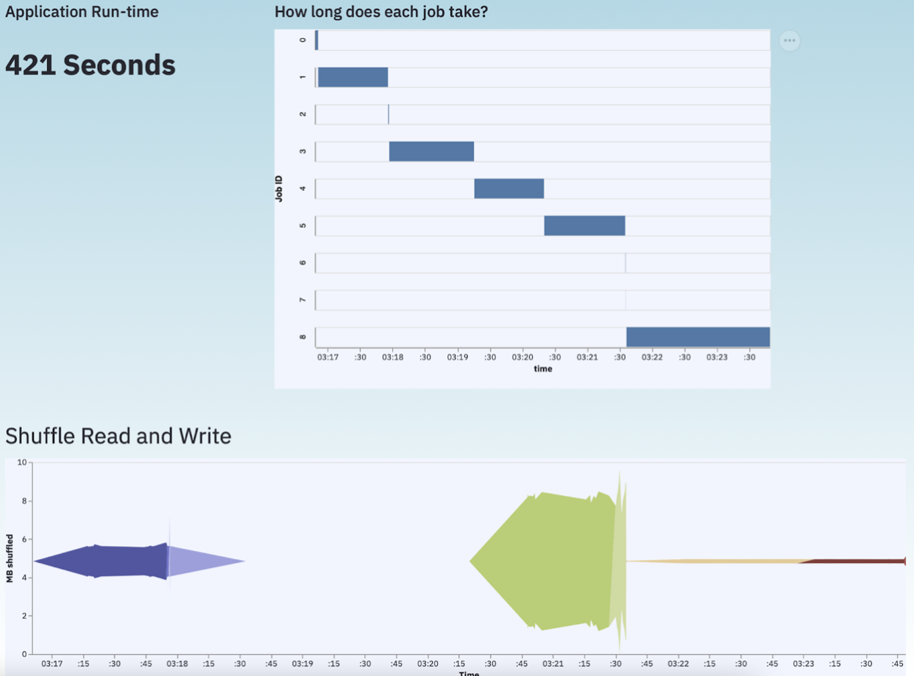

# Final Project Report

* **Online URL**:  https://share.streamlit.io/cmu-ids-2021/fp--05839-jblane-rlahiri-cvajiac-amichell/main/main_streamlitapp.py
* **GitHub Repo URL**: https://github.com/CMU-IDS-2021/fp--05839-jblane-rlahiri-cvajiac-amichell

### Abstract

The Apache Spark framework currently uses a tabular user interface, which offers limited usefulness for users. Our project, “A Better Spark User Interface”, considers the shortfalls of the original interface by creating more intuitive visual encodings and offering clearer insight into the operations of a Spark application. The interface uses two common Spark jobs - a word count and Extract, Transform, Load (ETL) job, and visualizes the implications of using varying optimization techniques to facilitate improving application performance.

## Introduction

As we generate more and more data over the last decade, frameworks to aid in parallel processing, such as MapReduce, Hadoop, and Spark, have risen in popularity. While these frameworks have made significant strides towards efficient parallel processing of large amounts of data, they are highly complex, and the details of these systems cannot always be abstracted away from the end-user. Oftentimes, a programmer or developer using these systems needs to understand where data is being transferred, which machines are running which jobs, and where bottlenecks might occur. Therefore, these parallel programming frameworks must have good interfaces to communicate necessary information to their users.

Unsurprisingly, interfaces for these programs are not the top priority, particularly for developers that are more systems-oriented. Below, we show an example of the current interface for Spark.

This UI displays some useful information, such as the job duration, stages, and a progress bar. However, all the information is displayed in tabular format and we don’t see a lot of useful information, such as memory usage or shuffle read/writes. It is particularly challenging to associate different pieces of information and gain a holistic understanding of the application’s performance.  While this information is available, it is not presented with effective visual encodings that identify the implication of different characteristics of Spark jobs.  Furthermore, once an application grows to hundreds or thousands of jobs, these tables become impossible to parse and navigate for useful information.

Since creating a new UI for such complex, dynamic systems that update in real-time is an incredibly lofty goal, we scoped this project by (a) focusing on Spark in particular, and (b) working to create an educational interface that, given a particular application, shows the effect of different optimizations on throughput, memory usage, and other metrics. For each Spark application, we want to show the time it spends executing, shuffling, and reading/writing data. We designed our visualization while keeping the eventual goal of a new Spark UI in mind, such that elements from our interface could be directly used in such an interface.

## Related Work

Our identification of the challenges associated with using the current Spark User Interface is not unique and this exact goal has been pursued recently by a data science company, Data Mechanics.  As a part of their new, cloud-native, Spark development platform, Data Mechanics offers a refined Spark User Interface focused on leveraging modern visual encoding methods to more clearly share information about spark jobs run on their platform.  Their Spark UI incorporates many of the same elements as our application.  This development focus and current effort within the industry serve to encourage the work that we have done in our project as it shows similar efforts in visual encodings.

By focusing our application as an educational tool, we targeted a niche within the Spark user base that enables us to provide value as an educational tool that visualizes the effectiveness of different optimization strategies.  While Data Mechanics released their product well after we had completed the design and majority of the implementation of our final project, we can reflect on what they have built as inspiration for our future work.

As a brief aside, and mostly unrelated to the visualization elements of our project, we generally would affirm the open-source nature of the Apache Spark framework.  Data Mechanics’ UI is maintained within their platform and has not been offered as an open-source alternative to the current Spark UI.  Should we continue the development of this visualization, our team would seek to offer our UI as a part of the Apache library maintained on GitHub and believe that our UI could be a useful future integration into a production release of this open-source framework.

## Methods

While our team attempted to leverage the techniques we had learned in this course over the semester specifically in visualization techniques, we also tried to model the processes we learned about as well.  Our initial meetings were modeled after those we learned that large design teams would participate in and we explored sketching in early phases of our project.  These general principles added structure to our design process and we think helped us to improve our final implementation.  We’ve included some more specific considerations below for how it all eventually came together.

### Overall layout

This application is divided into two main pages - the introduction home page and the main interface. The layout and design are constructed using standard streamlit functions. The pages are navigated via a Navigation menu created using the streamlit sidebar function. The main interface is designed as a separate class, that is invoked from the main function using the radio buttons in the sidebar.

### Home Page

The home page is the Introduction to the project. It uses the component.html functions to display Html and CSS features on the page. This is also how we inserted the different objects and controlled the fonts for the page. The content consists of introducing what Apache Spark does, explaining the types of jobs that we would be optimizing, and identifying the shortfalls of the current visualizations.

Each section is separated by expanders that default to closed and expand when the user clicks on the expanding bar. The first section consists of an imported image and a paragraph of text. The second section contains an image gallery carousel that allows users to click through different images created using PowerPoint. These images display explanations of the different jobs that we would be optimizing. The third section contains an image that displays an example of a current visualization problem with Apache Spark. A hover feature changes the image to show an overlay of text to help emphasize that what is displayed in this image is a problem worth fixing. An unordered list is used to bulletize the pros and cons of the original interface.

### Main Interface

The main interface consists of a dropdown menu to select the problem(Word Count, ETL) that the user wants to visualize. Moreover, the sidebar in the main interface contains the radio buttons to enable or disable any particular visualization on the main page.  For each application, we have provided three optimization options that the user can select using the checkbox, and view the corresponding changes in the plots and the application run-time. The user can also view the changes made to the code after selecting a particular optimization by expanding the section titled “Click Here to Display the Code!!!”.

### Data Collection

There are no generally available datasets readily available for this publicly, so we had to generate data ourselves.  This was enabled by Spark’s built-in logging framework that enabled output in many readily available, configurable formats.  While the most powerful application would have enabled student interaction and live code compilation and job running, this would have been unrealistic in an application like ours as it would require the maintenance of a high-performance cluster solely for this project.  For each task, we completed ten different variants of each application representing hours of CPU time in generating Spark jobs.

Among the considerations we navigated were trying to come up with interesting jobs that would be simple enough novice users could readily understand the application logic, but still would be interesting enough we could showcase the unique characteristics of our new user interface.  Since users would not be able to select the optimizations entirely on their own, we also created something of a narrative between these optimization attempts.  In our own experience as practitioners and with educating others as teaching assistants supporting students in learning these concepts, we went through several areas students will typically try to optimize and created an application that would reliably indicate important general characteristics for Spark as a framework.

## Results

We include the Wordcount example primarily as an introduction to our interface, and the greatest utility of our application comes when viewing the more complex, ETL example application.  When viewing our ETL example a user can gain a much greater appreciation for the benefits and improvements we have made to the Spark UI through improved application performance data visualizations.

One example of this improvement is from the way we visualize the initiation of events.  Events are the general abstraction that all Spark actions conform to.  By understanding how many events exist within a job users can gain an immediate macro view of the amount of work they are requiring the framework to do in their application.

The other useful piece of information to understand is when these events are initiated in the application’s life cycle.  When users can see how many events of each type are initiated throughout their application’s lifecycle they can understand more clearly how different development choices they make influence their application’s behavior.  By offering these visualizations of how many events are created and when in the application’s history they occur we can offer users an ability to understand how their application behaves generally over time.

In the second of these visualizations (the right chart in Figure 1), we introduce the time axis.  This axis is maintained throughout the remaining charts we display.  Intentionally chosen to highlight the temporal nature of Spark events, we are able to help users understand how decisions they make in implementing their spark job have effects throughout the framework as they can see the number of events initiated directly compared with other metrics.

One of those other metrics is the amount of data shuffled between nodes in the network.  We align this metric with the time spent working on each job in the application.  Keeping all three metrics on a common time scale helps to illustrate what events occur in the lifecycle of an application as different jobs are launched and they result in different amounts of data passing throughout the framework.

Users can compare the time jobs run for with the amount of data shuffled and understand how jobs their application runs affect different characteristics of its performance.  This is aligned with the most important overall statistic, the application’s overall runtime.  Everyone wants their code to run quickly and with the insights offered by this improved user interface, users are more quickly able to learn how to apply optimization techniques they may have learned about from the Spark documentation or in a course!

## Discussion

By selecting from different optimizations and combinations of optimizations, users can see the impact their selected optimization had on the performance of the application in question.  This interaction can help to reinforce different characteristics of the Spark framework and illustrate interesting benefits and limitations to different optimization strategies.  One of the greatest limitations of the current Spark UI is the difficulty in understanding the inter-related nature of different metrics generated by the framework.  The common piece of information between all of these metrics is time and by visualizing each metric compared to this constant metric we can create a much more useful visualization.  While advanced users are able to work around this challenge in the traditional UI, we believe even they would benefit from the improved visualizations we offer as it would reduce the time they spend in sharing their work with others.  Developers often work in teams and a better user interface can make it much easier for team members to communicate the benefits of different changes they make in their application logic.

The other key benefit we offer is the ability to explore the code that created the data we visualize.  When offering an educational tool like ours, sharing the code is very powerful.  It allows students and explorers to learn from our application in interesting ways and contributes to users’ ability to directly associate changes in the source code with key performance metrics we display in our new user interface.

## Future Work

While our visualization is useful in identifying trends in spark logs, it would be interesting and useful to identify these trends in real time.  This is the most obvious area for future work and would lead our visualization to transfer from a historical comparison of previously run Spark jobs to a useful real time user interface.  This add-on could be shipped as a component to improve the usability of the Spark framework.  Before we could offer this to the larger spark community, we would benefit from including a few other functionalities.

We are proud to offer an improved macro view of a Spark application’s execution, but there is a need, particularly for larger clusters, to be able to focus your insights for specific nodes, tasks, jobs, and stages.  At the node level, we would benefit from building additional visualizations specific to the physical machine running as a part of a Spark cluster.  This machine level information would be helpful in understanding more advanced and nuanced topics in parallel processing as well as helping developers further optimize their parallel computing applications.  Tasks, jobs, and stages all represent subsets of the over application a user may run.  By getting more specific information about each component, we would offer users the ability to adjust the resolution with which they consider their application’s performance.  This is key functionality that goes beyond the scope of what we set out to accomplish, but would be an interesting and necessary extension for our work moving forward.

Our final area of future work would be to add an additional visualization that communicates the fundamental abstraction in Spark, a directed acyclic graph (DAG).  We believe creating a view that incorporates the DAG into the rest of the job would assist users in understanding the lineage of their data transformations and would enhance users' understanding of their jobs in a meaningful way.
